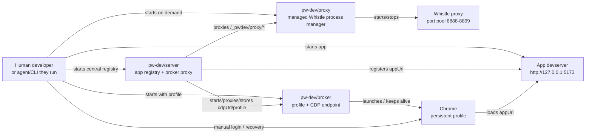
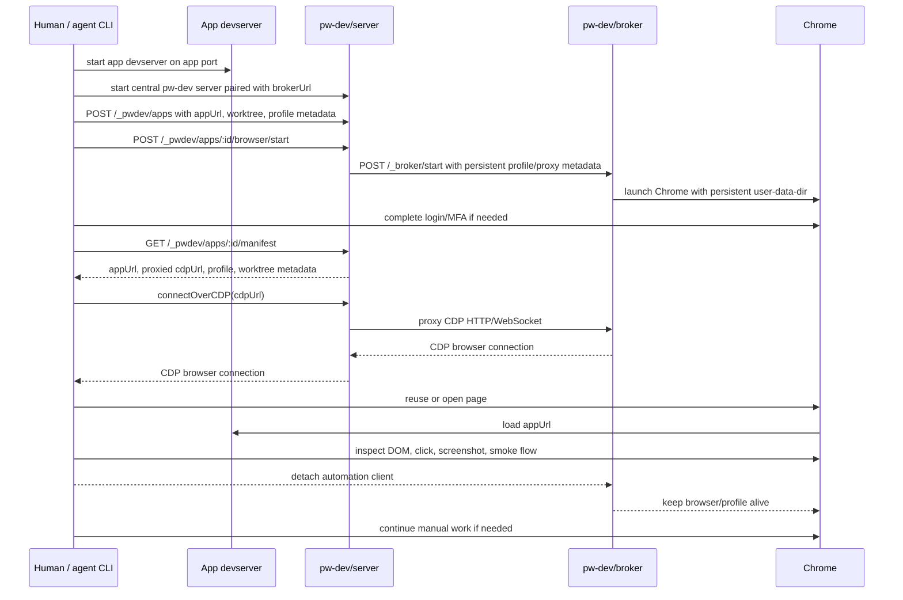
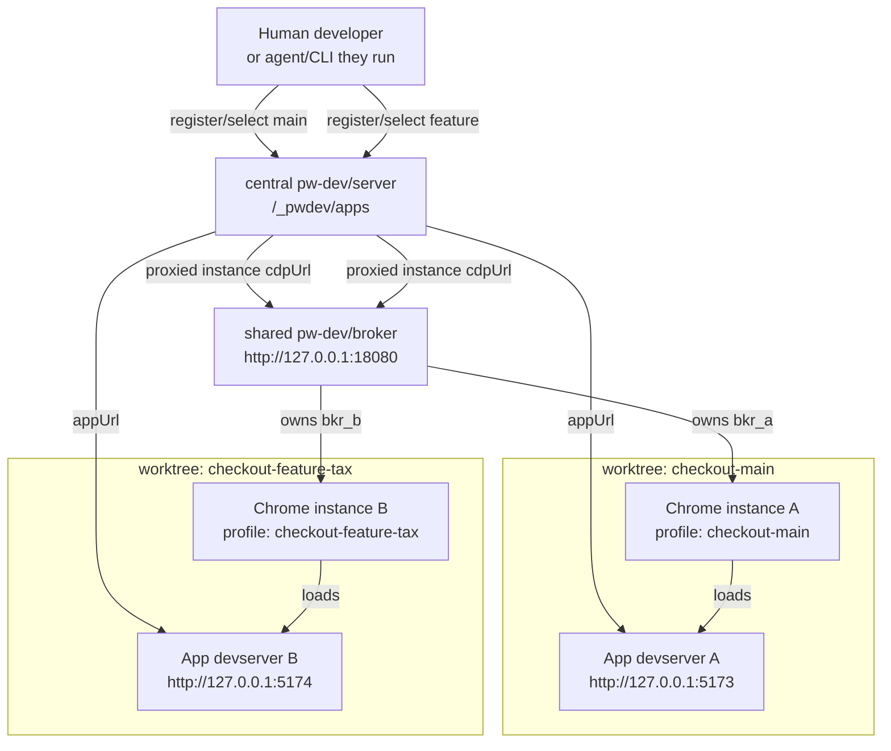

# pw-dev Architecture

`pw-dev` separates app serving, browser ownership, and browser operation.

- The app is the actual development target.
- `@pw-dev/server` is the central app registry, paired with a broker, and gives tools stable URLs.
- `@pw-dev/cdp-broker` owns local Chrome, persistent profiles, and CDP access.
- `@pw-dev/proxy` is optional. It starts/stops managed Whistle proxy processes
  from external-agent rulesets, while the server proxies its API.
- A human, or the agent/CLI they run, operates Chrome through the
  broker-backed session.

## Components



## Runtime Flow



## Multi-App Flow

For multiple worktrees, each app has its own app devserver. A central
`pw-dev/server` registry tracks all apps. By default they share one
`pw-dev/broker` process. The server asks the broker to start one Chrome
instance/profile per app and stores server-proxied, instance-scoped CDP URLs on
each app.



Separate broker processes are still possible, but they are not the default.
They are only needed for broker-level isolation, different SSH tunnel settings,
or intentionally separate lifecycle boundaries.

## Contracts

The server should expose stable discovery endpoints:

```text
GET /_pwdev/manifest
GET /_pwdev/status
GET /_pwdev/instructions
GET /_pwdev/client.js
GET /_pwdev/proxies
POST /_pwdev/proxies
GET /_pwdev/proxies/:id
DELETE /_pwdev/proxies/:id
GET /_pwdev/networks
POST /_pwdev/networks
GET /_pwdev/networks/:id
DELETE /_pwdev/networks/:id
POST /_pwdev/networks/:id/check
GET /_pwdev/apps
POST /_pwdev/apps
GET /_pwdev/apps/:id
DELETE /_pwdev/apps/:id
GET /_pwdev/apps/:id/manifest
GET /_pwdev/apps/:id/browser/status
POST /_pwdev/apps/:id/browser/start
POST /_pwdev/apps/:id/browser/stop
ANY /_pwdev/broker/*
GET /_pwdev/proxy/status
GET /_pwdev/proxy/proxies
POST /_pwdev/proxy/proxies
GET /_pwdev/proxy/proxies/:id
DELETE /_pwdev/proxy/proxies/:id
POST /_pwdev/proxy/proxies/:id/stop
POST /_pwdev/proxy/stop-all
```

The manifest is the main agent contract:

```json
{
  "ok": true,
  "id": "checkout-feature-tax",
  "name": "Checkout tax branch",
  "worktree": "/home/me/work/app-tax",
  "branch": "feature/tax",
  "appUrl": "http://127.0.0.1:5174",
  "accounts": {
    "login": {
      "usr": "xxx",
      "pwd": "xxx"
    }
  },
  "cdpUrl": "http://127.0.0.1:9696/_pwdev/broker/instances/bkr_feature_tax",
  "profile": "checkout-feature-tax",
  "proxyId": "whistle-main"
}
```

The agent should use the API for discovery and its own Playwright client for
browser operations. It does not need the broker base URL because `cdpUrl`
points at the pw-dev server's broker proxy:

```js
import { chromium } from 'playwright';

const manifest = await fetch(`${process.env.PW_DEV_URL}/_pwdev/apps/checkout-feature-tax/manifest`)
  .then((response) => response.json());

const browser = await chromium.connectOverCDP(manifest.cdpUrl);
const context = browser.contexts()[0];
const page = context.pages()[0] ?? await context.newPage();

await page.goto(manifest.appUrl);
```

## Design Rules

- CLI starts and stops things for humans.
- API exposes structured discovery and control for agents.
- The server does not import Playwright by default.
- The server records app, proxy, devserver, engine, and account metadata; it is
  not an app runner or proxy runner. Account metadata is for non-production
  test accounts only.
- `proxy` is the optional runner for managed Whistle proxies. It accepts
  external-agent rulesets, allocates separate proxy and GUI ports, registers
  the proxy, and can attach it to an app.
- The broker owns Chrome and persistent profile state.
- The agent attaches to the broker and does not close the browser unless asked.
- One broker process can own multiple Chrome instances/profiles.
- One app id should map to one broker profile and one instance-scoped CDP URL by default.
