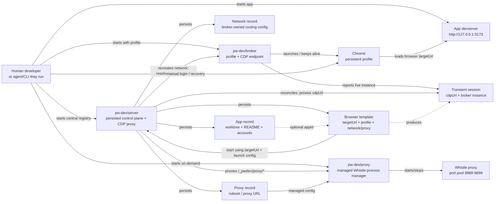
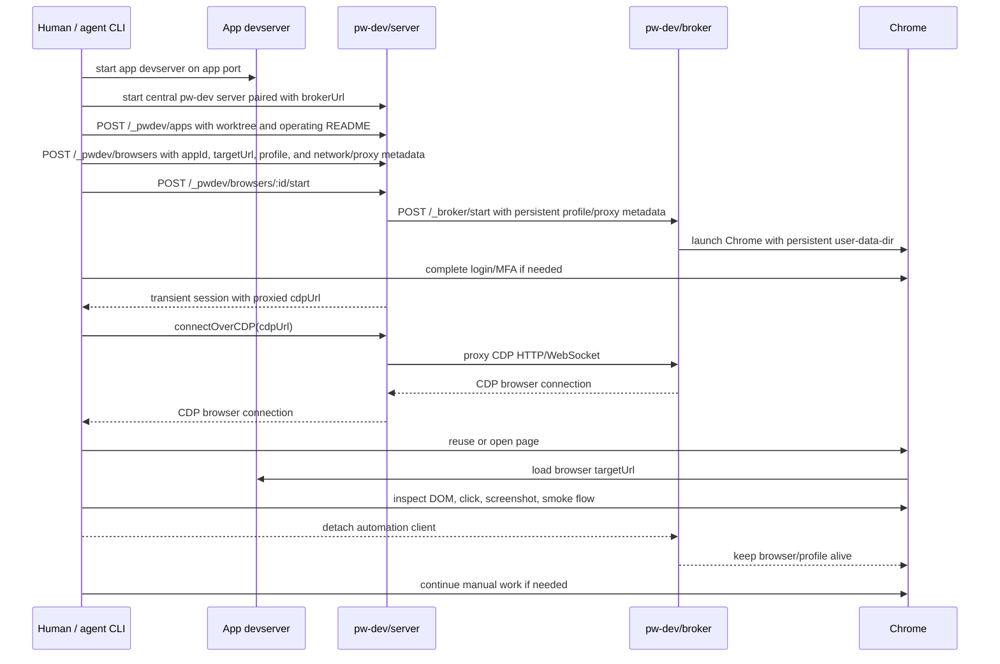
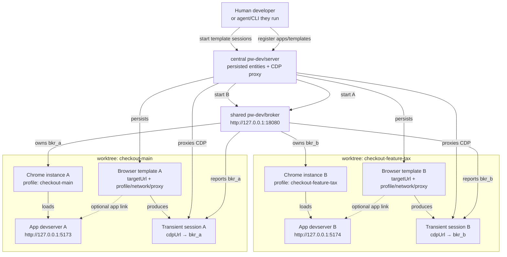

# pw-dev Architecture

`pw-dev` separates app serving, browser ownership, and browser operation.

- The app is the actual development target.
- `@pw-dev/server` is the central app registry, paired with a broker, and gives tools stable URLs.
- `@pw-dev/cdp-broker` owns local Chrome, persistent profiles, and CDP access.
- `@pw-dev/proxy` is optional. It starts/stops managed Whistle proxy processes
  from external-agent rulesets, while the server proxies its API.
- A human, or the agent/CLI they run, operates Chrome through the
  broker-backed session.

## Components



## Runtime Flow



## Multi-App Flow

For multiple worktrees, each app has its own app devserver. A central
`pw-dev/server` registry tracks persisted apps and browser templates. By
default they share one `pw-dev/broker` process. The server asks the broker to
start one Chrome instance/profile per browser-template session; the returned
server-proxied, instance-scoped CDP URL belongs to the transient session, not
the app or template.



Separate broker processes are still possible, but they are not the default.
They are only needed for broker-level isolation, different SSH tunnel settings,
or intentionally separate lifecycle boundaries.

## Contracts

The server should expose stable discovery endpoints:

```text
GET /_pwdev/manifest
GET /_pwdev/status
GET /_pwdev/instructions
GET /_pwdev/api
GET /_pwdev/env
GET /_pwdev/client.js
GET /_pwdev/proxies
POST /_pwdev/proxies
GET /_pwdev/proxies/:id
DELETE /_pwdev/proxies/:id
GET /_pwdev/proxies/:id/traffic
GET /_pwdev/networks
POST /_pwdev/networks
GET /_pwdev/networks/:id
DELETE /_pwdev/networks/:id
POST /_pwdev/networks/:id/check
GET /_pwdev/apps
POST /_pwdev/apps
GET /_pwdev/apps/:id
DELETE /_pwdev/apps/:id
GET /_pwdev/apps/:id/manifest
GET /_pwdev/browsers
POST /_pwdev/browsers
GET /_pwdev/browsers/:id
DELETE /_pwdev/browsers/:id
POST /_pwdev/browsers/:id/start
POST /_pwdev/browsers/:id/stop
GET /_pwdev/sessions
POST /_pwdev/sessions/:id/stop
ANY /_pwdev/broker/*
GET /_pwdev/proxy/status
GET /_pwdev/proxy/proxies
POST /_pwdev/proxy/proxies
GET /_pwdev/proxy/proxies/:id
DELETE /_pwdev/proxy/proxies/:id
POST /_pwdev/proxy/proxies/:id/stop
POST /_pwdev/proxy/stop-all
```

Apps are project metadata; browser templates own launch and target settings;
sessions are transient broker-backed runtime records. The app manifest remains
useful for app metadata, but it does not provide a live browser CDP URL:

```json
{
  "ok": true,
  "id": "checkout-feature-tax",
  "name": "Checkout tax branch",
  "worktree": "/home/me/work/app-tax",
  "branch": "feature/tax",
  "accounts": {
    "login": {
      "usr": "xxx",
      "pwd": "xxx"
    }
  },
  "readme": "Run npm run dev; compose proxy rules from proxy/rules.tpl"
}
```

The agent should use the API for discovery and its own Playwright client for
browser operations. Start a browser template and connect to the returned
session `cdpUrl`; it points at the pw-dev server's broker proxy:

```js
import { chromium } from 'playwright';

const started = await fetch(`${process.env.PW_DEV_URL}/_pwdev/browsers/checkout-feature-tax/start`, {
  method: 'POST',
})
  .then((response) => response.json());

const browser = await chromium.connectOverCDP(started.session.cdpUrl);
const context = browser.contexts()[0];
const page = context.pages()[0] ?? await context.newPage();

await page.goto(started.browser.targetUrl);
```

## Design Rules

- CLI starts and stops things for humans.
- API exposes structured discovery and control for agents.
- The server does not import Playwright by default.
- The server persists app, browser-template, network, and proxy metadata; it
  is not an app runner or proxy runner. Sessions are transient. Account
  metadata is for non-production test accounts only.
- `proxy` is the optional runner for managed Whistle proxies. It accepts
  external-agent rulesets, allocates separate proxy and GUI ports, registers
  the proxy, and can attach it to an app.
- The broker owns Chrome and persistent profile state.
- The agent attaches to the broker and does not close the browser unless asked.
- One broker process can own multiple Chrome instances/profiles.
- A browser template can start a default session or named parallel sessions;
  named sessions get isolated profiles by default.
